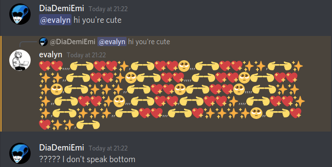
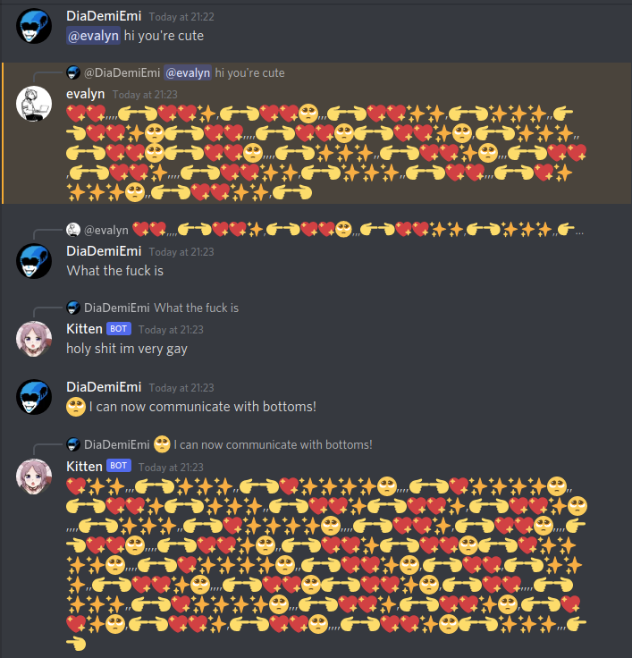

# Discord Kitten
This is a Discord bot written in Rust to translate to and from [the Bottom Encoding Standard](https://github.com/bottom-software-foundation/spec) using [bottom-rs](https://github.com/bottom-software-foundation/bottom-rs) and [Serenity](https://github.com/serenity-rs/serenity).  

## Ever had this problem?
You give a bottom a compliment and they reply in fluent bottom! And as a top (I swear) you can't understand this foreign language!  
  
 
## Well, no more!
With this bot you can translate to and from bottom on the fly to communicate with bottoms!  
  

### Usage
When starting the bot for the first time it will generate a `config.toml` file, replace the `bot_token` field with your Discord bot token.  
The `prefixes` list contains the prefixes this bot will listen to, you can add or remove as many as you want.  
The boolean `allow_overflow` determines if the bot should split long messages into several and send them all. This creates HUGE amounts of spam, but it's funny.  
The default config is the following:  

```
bot_token = "XXXXXX"
prefixes = ["🥺", "What the fuck is", "use your words", "I don't speak bottom", "I dont speak bottom"]
allow_overflow = true
```

The bot listens to these prefixes and when found will translate either the message contents following the prefix or translate the content of the message that is replied to.  